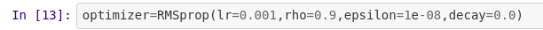

# flower Recognition

we print out location of our python file using this command. 
**os.listdir** will give names of all files in the location given to it. 

**os.path.join** simply joins location we do this so we can loop through each folder in flowers 
those files in that location which ends with jpg will go through if statement. 
simply get images from that folder resize it to given size then store them in image_train. 

now since we have stored our data folder wise all training examples of same category are together 
now that is not a good practice so what we do is we zip together pixel values of images and thier categories. 
then rearrange them in random order 
then get back train data(pixels) and labels. 

now since given labels are strings we cant put them in model so we have to 1st convert them into intergers. 
it is automatically done by **label_encoder**. 
once they are integers we use **one-hot_encoding**. 
it basically converts 3 to (0,0,0,1,0) and 1 to (0,1,0,0,0).....  
**there are four 0s and one 1 because total no of categories are 5**

split date into 2 parts to use 2nd part for validation I have used 0.9-0.1 split in out case. 
we do this to make sure our model is not **overfitting**. 

created a simple model. 
here in 1st line when we add **conv2D layer** --> 
we have to mension imput_size of each image in our 1st layer of our model.(28x28x1) 
our image has its **depth 3** that is why there is 64x64x3 image not 64x64. 
coloured images are usually represented with RGB that is **depth 3**. 
**filters** mean depth of our layer after convolution. 
**kernel_size** is filter size that convolve over our image. 
**padding** is 0s we put to have image of size we want after convolution. 
it is good to use activation after every conv layer so we use **relu activation** as it is very less coputationally expensive. 
this ends our **convolutional layer**. 
**max pool layer** simpy chooses maximum from its filter nothing to explain. 
**dropout layer** is used to avoid overfitting. 
**flatten** converts the tensor like output from conv layers to a vector which can be used in **dense(simple neural net)** layer. 
our last layer have only 10 units as our output is a vecotor of (1x10). 
since it is last layer we can use better activation that is softmax

set your optimizer that will do your **gradient descent** step.(better if you use **Adam** as it converges faster) 

pass your **optimizer** and also choose your **loss function** and **metrics** and compile your model 

if your loss is almost constant then this wil reduce learning rate so it can improve further. 

we can create more data by **data augementation** method which simpy changes images little bit 
solving our problem of having less data. :)  

train the model(by the way verbose means how you want to show training process) 

please share if this helped :)
